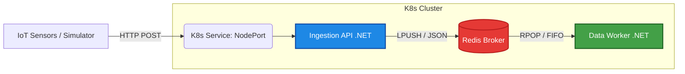
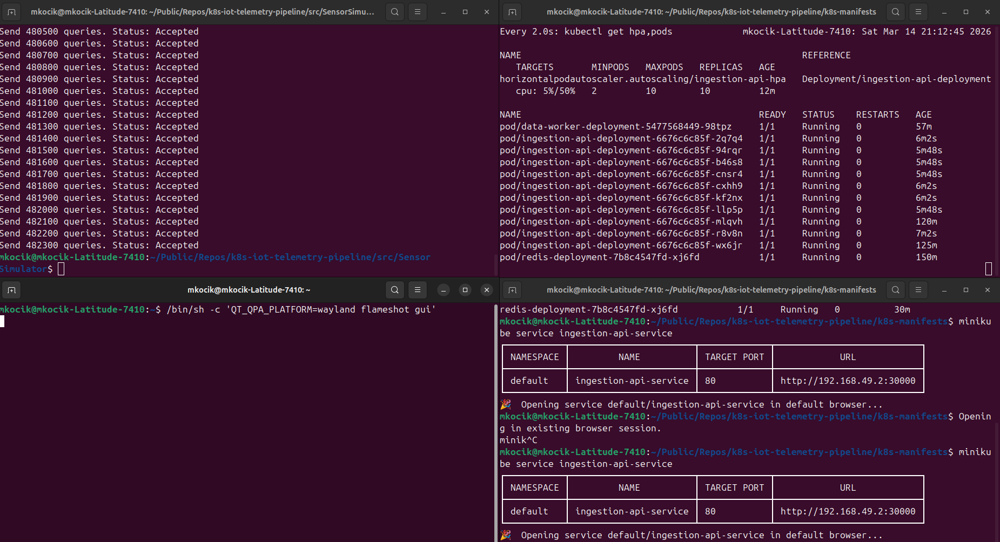

# IoT Telemetry Pipeline

A high-throughput, asynchronous event processing pipeline built with .NET 10, Redis, and Kubernetes. Designed to handle massive spikes in IoT sensor traffic without data loss or system failure.

---

## The Problem It Solves

In traditional synchronous architectures, a massive spike in incoming IoT sensor data (e.g., thousands of devices reconnecting simultaneously after a network outage) directly hits a relational database. This leads to:

1. Database locking and connection pool exhaustion.
2. Thread starvation on the API level.
3. HTTP 504 Gateway Timeouts and ultimately, permanent data loss.

**The Solution:** This project implements a **Producer-Consumer** pattern using an in-memory Message Broker (Redis) as a shock absorber. The API (Producer) instantly offloads the payload to Redis and returns an HTTP response in milliseconds. A background service (Consumer) processes the queue at its own pace. If the incoming traffic exceeds CPU thresholds, the Kubernetes Horizontal Pod Autoscaler (HPA) automatically provisions additional API instances to absorb the load.

---

## Architecture Overview



---

## Components

|   | Component | Role |
|---|-----------|------|
| 1 | **Ingestion API** (Producer) | A lightweight .NET Minimal API that receives telemetry data and queues it in Redis. Scales dynamically via K8s HPA. |
| 2 | **Redis** (Message Broker) | Acts as an in-memory buffer, preventing database overload during traffic spikes. |
| 3 | **Data Worker** (Consumer) | A background .NET Hosted Service that asynchronously pops and processes messages from the Redis queue. |
| 4 | **Sensor Simulator** | A multi-threaded C# console application used for load testing the cluster. |

---

## Load Testing & Autoscaling (HPA)

The architecture was validated using a custom load generator to simulate a DDoS-like traffic spike:

- **Load:** Over 480,000 requests fired at the cluster in a matter of minutes.
- **Autoscaling:** Kubernetes HPA detected CPU utilization spikes (>50%) and automatically scaled the Ingestion API from **2 to 10 Pods**.
- **Result:** **0 dropped requests.** All data was safely buffered in Redis, waiting for the Workers to process them sequentially.



---

## Technologies

- **C# / .NET 10** — Minimal APIs, Worker Services
- **Docker** — Multi-stage builds
- **Kubernetes** — Deployments, Services, HPA, Metrics Server
- **Redis** — StackExchange.Redis

---

## How to Run Locally

### 1. Start Minikube & Enable Metrics Server

```bash
minikube start
minikube addons enable metrics-server
```

### 2. Deploy the Infrastructure

```bash
kubectl apply -f k8s-manifests/
```

### 3. Open the API Tunnel

```bash
minikube service ingestion-api-service
```

### 4. Start the Load Test

Update the API URL in `src/SensorSimulator/Program.cs` with the tunnel address, then run:

```bash
cd src/SensorSimulator
dotnet run
```