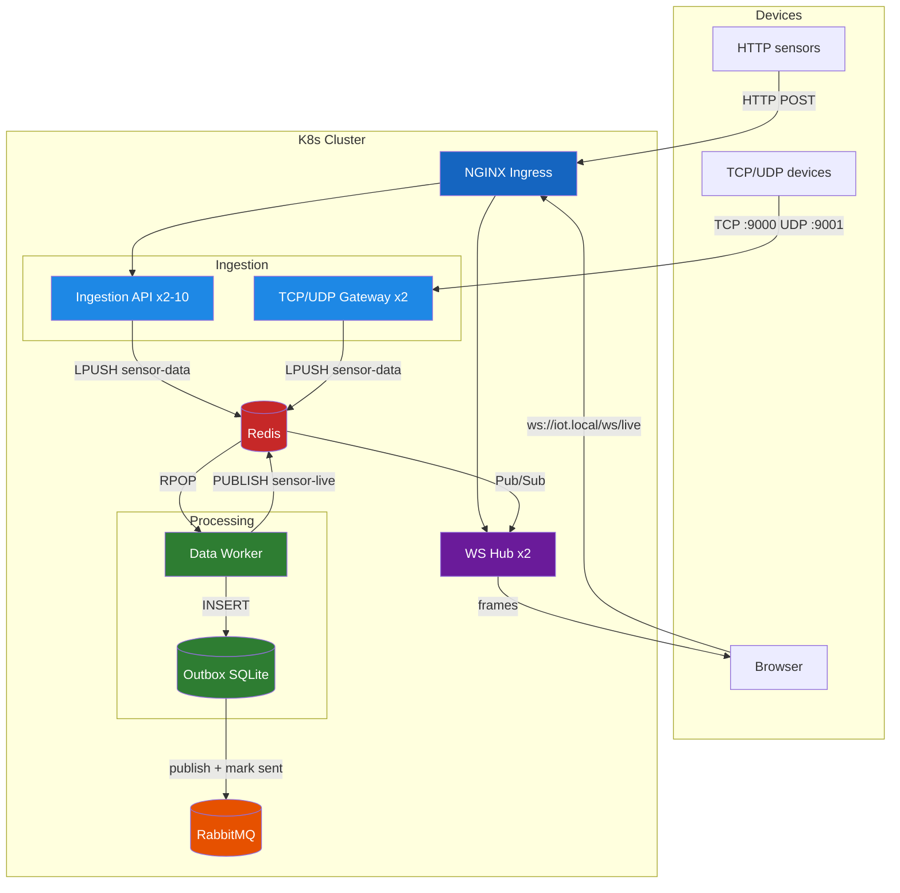

# IoT Telemetry Pipeline

A production-grade IoT data pipeline built with .NET 10 and Kubernetes. Designed to ingest high-frequency sensor data from multiple protocols, process it asynchronously, and stream results to connected browsers in real time — without data loss under any traffic conditions.

---

## The Problem It Solves

When thousands of IoT devices reconnect simultaneously after a network outage, a traditional synchronous architecture collapses:

1. The API blocks waiting for the database to confirm each write.
2. Thread pool exhausts — new requests queue up and time out.
3. HTTP 504 errors start appearing. Data is permanently lost.

This project solves that with a layered architecture where no component ever blocks another:

- The **Ingestion API** accepts a sensor payload, pushes it to Redis, and returns HTTP 202 in under 1ms — it never touches a database.
- The **Data Worker** processes messages from Redis at its own pace, completely decoupled from inbound traffic.
- If inbound traffic spikes beyond CPU capacity, **Kubernetes HPA** automatically scales the Ingestion API from 2 to 10 pods.
- After processing, every event is written to an **outbox table** before being published to RabbitMQ — so even if the broker goes down, no event is ever lost.
- Processed events are broadcast over **Redis Pub/Sub** to all WebSocket hub pods, which stream them live to connected browsers.

---

## Architecture



---

## Components

| # | Component | Role |
|---|-----------|------|
| 1 | **Ingestion API** | .NET Minimal API. Accepts HTTP sensor payloads, pushes to Redis. Scales 2→10 via HPA. |
| 2 | **TCP/UDP Gateway** | .NET Worker Service. Opens raw TCP :9000 and UDP :9001 listeners. Pushes to the same Redis queue. |
| 3 | **Redis** | In-memory buffer (LPUSH/RPOP queue) and Pub/Sub broker for WebSocket fan-out. |
| 4 | **Data Worker** | .NET Worker Service. Pops from Redis, processes each message, writes outbox row, publishes to Pub/Sub. |
| 5 | **Outbox + RabbitMQ** | SQLite outbox table guarantees at-least-once delivery to RabbitMQ even if the broker is temporarily down. |
| 6 | **WebSocket Hub** | .NET Minimal API. Browsers connect via `ws://iot.local/ws/live` and receive processed events in real time. Uses `System.Threading.Channels` per connection for backpressure. |
| 7 | **NGINX Ingress** | Single entry point. Routes HTTP, WebSocket (Upgrade header), and RabbitMQ management UI. |
| 8 | **Sensor Simulator** | Multi-threaded C# console app. Fires 100 parallel sensors to load test HPA autoscaling. |

---

## Load Test Results

- **Load:** 480,000+ requests in a few minutes
- **Autoscaling:** HPA scaled Ingestion API from 2 → 10 pods at >50% CPU
- **Result:** 0 dropped requests — all data buffered in Redis


---

## Technologies

- **C# / .NET 10** — Minimal APIs, Worker Services, BackgroundService, System.Threading.Channels
- **Docker** — multi-stage builds
- **Kubernetes (minikube)** — Deployments, Services, HPA, ConfigMap, Ingress, PVC
- **Redis** — StackExchange.Redis, LPUSH/RPOP queue, Pub/Sub
- **RabbitMQ** — direct exchange, durable queues, outbox pattern
- **NGINX Ingress** — HTTP routing, WebSocket upgrade
- **GitHub Actions** — CI: build + validate manifests

---

## How to Run Locally

### 1. Start minikube

```bash
minikube start
minikube addons enable metrics-server
minikube addons enable ingress
```

### 2. Add local DNS

```bash
echo "$(minikube ip)  iot.local" | sudo tee -a /etc/hosts
```

### 3. Create the Secret

```bash
kubectl create secret generic iot-secret \
  --from-literal=REDIS_CONNECTION="redis-service.default.svc.cluster.local:6379"
```

### 4. Build and load images

```bash
docker build -t mkocik/iot-ingestion-api:v1.0    ./src/IngestionApi
docker build -t mkocik/iot-data-worker:v1.0      ./src/DataWorker
docker build -t mkocik/iot-tcp-udp-gateway:v1.0  ./src/TcpUdpGateway
docker build -t mkocik/iot-ws-hub:v1.0           ./src/WsHub

minikube image load mkocik/iot-ingestion-api:v1.0
minikube image load mkocik/iot-data-worker:v1.0
minikube image load mkocik/iot-tcp-udp-gateway:v1.0
minikube image load mkocik/iot-ws-hub:v1.0
```

### 5. Deploy

```bash
kubectl apply -f k8s-manifests/
```

### 6. Test HTTP ingestion

```bash
curl -X POST http://iot.local/api/telemetry \
  -H "Content-Type: application/json" \
  -d '{"SensorId":"sensor-01","Temperature":42,"Timestamp":"2025-01-01T00:00:00Z"}'
```

### 7. Test TCP ingestion

```bash
minikube tunnel  # run in a separate terminal

echo '{"SensorId":"plc-01","Temperature":55,"Timestamp":"2025-01-01T00:00:00Z"}' \
  | nc 127.0.0.1 9000
```

### 8. Open WebSocket live feed

Open `docs/ws-test-client.html` in a browser and click Connect.

### 9. Load test + watch HPA

```bash
cd src/SensorSimulator && dotnet run

# in another terminal
kubectl get hpa ingestion-api-hpa --watch
```

### 10. RabbitMQ management UI

Open [http://iot.local/rabbitmq](http://iot.local/rabbitmq) — login: `guest / guest`